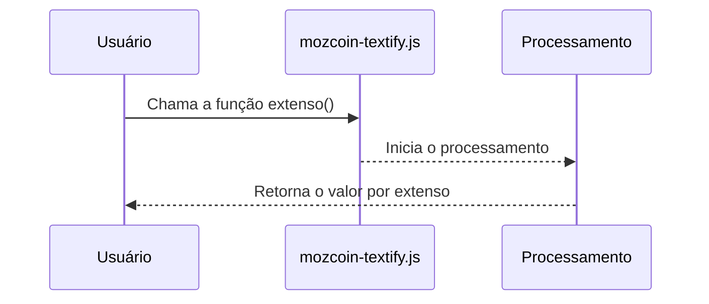

# MozCoin Textify 

A  **MozCoin Textify** é uma biblioteca JavaScript que permite transformar valores numéricos da moeda moçambicana por extenso. Esta biblioteca baseia-se em configurações definidas em um arquivo `config.json` para garantir a formatação correcta do valor.

_Nota:_ Antes de começar a utilizar, é necessário compreender que nesta versão inicial o arquivo `mozcoin-textify.js` depende das configurações externas que estão contidas no arquivo `config.json`. 


## Uso (com Promises)

Para utilizar o **MozCoin Textify**, basta chamar o método `extenso()` em uma String que contém o valor numérico para representar por extenso. A função `extenso()` retorna uma ``Promise``, que podemos tratar da seguinte forma:

```javascript

"2000.50".extenso().then(resultado  => {

alert(resultado)

}).catch(erro  => {

console.error("Ocorreu um erro ao representar err:[" + erro+"]");

});

```
 Exemplo completo em um arquivo ``.html``
````html
<!DOCTYPE html>
<html lang="en">
<head>
    <meta charset="UTF-8">
    <meta http-equiv="X-UA-Compatible" content="IE=edge">
    <meta name="viewport" content="width=device-width, initial-scale=1.0">
    <title>Teste</title>
    <script src="mozcoin-textify.js"></script>
</head>
<body>
    
<script>
  
  "2000.50".extenso().then(resultado => {
    alert(resultado)
}).catch(erro => {
    console.error("Ocorreu um erro ao representar err:[" + erro+"]");
});

</script>

</body>
</html>

````


***NOTA***
> O arquivo **mozcoin-textify.js** deve funcionar junto com o arquivo **config.json**.
> O arquivo **config.json** contém configurações pertinentes que incluem a forma como a unidade da moeda será representado tanto no plural assim como no singular. Na próxima secção poderá compreender com mais detalhes relativamente ao arquivo de configuração.


## Configuração
O arquivo `config.json` é essencial para definir as configurações que a função ``extenso()`` utiliza ao transformar valores numéricos para moeda moçambicana por extenso.
No arquivo `config.json`, especifiquei alguns detalhes como o **separador decimal** (por exemplo, o ponto ou a vírgula), o **símbolo da moeda** (que é o "MT"), o **separador de milhares** (como vírgula) e outros que serão apresentados abaixo.

Aqui irei apresentar o código contido no arquivo `config.json`` e explicarei a função de cada chave.
````json
{

	"data": {

		"currencySymbol": "MT",

		"separadorDecimal": ".",

		"separadorDeMilhares": ",",

		"unit": "Metical",

		"subunit": "Centavo",

		"unitsingular": "metical",

		"unitplural": "meticais",

		"subunitsingular": "centavo",

		"subunitplural": "centavos",

		"conjuncao": "e",

		"conjuncaoSymbol": "&"

	},

			"author": {

				"name": "Kelven Cassamo",

				"tel": "(+258) 844920441",

				"tel_alt": "(+258) 878920441",

				"email": "kelvencassamo9@gmail.com",

				"github": "https://github.com/KelvenCassamo",

				"Address": "Marracuene, Agostinho Neto. Avenida de Mocambique."

	},
    "build": {
        "version": "1.0.0",
        "name": "BETA"
    }

}
````

### Explicação das Configurações

-  `"currencySymbol"`: Serve para definir o símbolo da moeda (por exemplo, "MT"). 

-  `"separadorDecimal"`: Serve para definir o separador decimal a ser usado. No caso do código acima, nós utilizamos o "." para definir o separador.  Podemos no entanto alterar para ",", porém devemos levar em consideração que será necessário substituir o separador da configuração de **separadorDeMilhares**. Se utilizarmos o separador  **" . "** no **separadorDecimal** devemos utilizar o separador **" , "** no  **separadorDeMilhares** e vice-versa.

-  `"separadorDeMilhares"`: Serve para definir o separador de milhares a ser usado, a abordagem é mesma. 

-  `"unit"`: Podemos utilizar para definir o nome da unidade da moeda (por exemplo, "Metical").

-  `"subunit"`: Podemos utilizá-lo para definir o nome da subunidade da moeda que é no caso o "Centavo". 

- `"unitsingular"`: Serve para definir a forma singular do nome da unidade da moeda. Está configuração é chamada quando o valor é equivalente à **1**. Por exemplo, "um metical".

-  `"unitplural"`: Serve para definir a forma plural do nome da unidade da moeda. Está configuração é chamada quando o valor é superior à **1**. Por exemplo,  "dois meticais".

- `"subunitsingular"`: Serve para definir a forma singular do nome da subunidade da moeda. Esta configuração é chamada quando o valor da parte decimal é equivalente à **1**. Por exemplo, "um centavo".

- `"subunitplural"`: Serve para definir a forma singular do nome da subunidade da moeda. Esta configuração é chamada quando o valor da parte decimal é superior à **1**. Por exemplo, "cinquenta centavos".

-  `"conjuncao"`: Serve para definir a conjunção usada entre a parte inteira e a parte decimal. Por exemplo, "vinte e cinco meticais **e** cinquenta centavos "

- `"conjuncaoSymbol"`: Serve para definir o símbolo para a conjunção. Como alternativa, podemos utilizar o **" & "** ao invés de **" e "**.

## Exemplos

-   `2457.42` será formatado como "Dois mil e quatrocentos e cinquenta e sete meticais e quarenta e dois centavos".
-   `1000` será formatado como "Mil meticais".
-   `25` será formatado como "Vinte e cinco meticais".

> **_Nota:_ Conforme puderam ver no exemplo anterior, a função `extenso()` também aceita números decimais para representar centavos.**


## Fluxo de Processamento da Função `extenso()`
Este fluxograma mostra o processo de conversão usando a função `extenso()`. Primeiro o usuário chama a função ``extenso()`` no arquivo `mozcoin-textify.js`. Em seguida, a função ``extenso()``  processa o valor, realiza a conversão *( separação da parte inteira e da parte fracionária, substituição por palavras de acordo com as configurações) e*, finalmente, retorna o resultado por extenso ao usuário. Neste fluxograma tentei explicar de forma clara o processo de transformação do valor numérico em uma  moeda moçambicana por extenso.




## Contatos

Para qualquer dúvida pessoal ou caso queira conhecer-me, sinta-se à vontade para entrar em contato:

-   **Nome:** Kelven Cassamo Sulemane
-   **E-mail:** kelvencassamo9@gmail.com
-   **Chamadas:** (+258) 878920441
-   **Whatsapp:** [(+258) 844920441](https://api.whatsapp.com/send?phone=+258844920441)
-   **Link para o chat do Whatsapp:** https://api.whatsapp.com/send?phone=+258844920441
-   **GitHub:** https://github.com/KelvenCassamo


## Contribuição

Se encontrar problemas ou quiser contribuir, sinta-se à vontade para abrir uma [issue](https://github.com/KelvenCassamo/MozCoin-Textify/issues) ou enviar um [pull request](https://github.com/KelvenCassamo/MozCoin-Textify/pulls) .


## Licença

Este projeto é licenciado sob a Licença  ``MIT License`` - pode ver no arquivo [LICENSE.md](https://github.com/KelvenCassamo/MozCoin-Textify/blob/main/LICENSE) para detalhes.


